

  

  
  
  
  
  
   
  <a href="https://www.python.org"></a>
  
  
  
  <a href="https://git-scm.com/">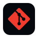</a>
   
  
  
  
  
  <a href="https://www.raspberrypi.com/"></a>

 

  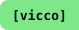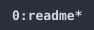<a href="https://www.linkedin.com/in/victoria-correia-7aa4a3238">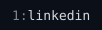</a><a href="https://github.com/VictoriaSCorreia">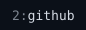</a><a href="mailto:victoriacorr0312@gmail.com">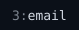</a><a href="https://www.instagram.com/victoria.json/">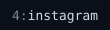</a><a href="https://victoriacorreia.com/">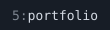</a>

  

